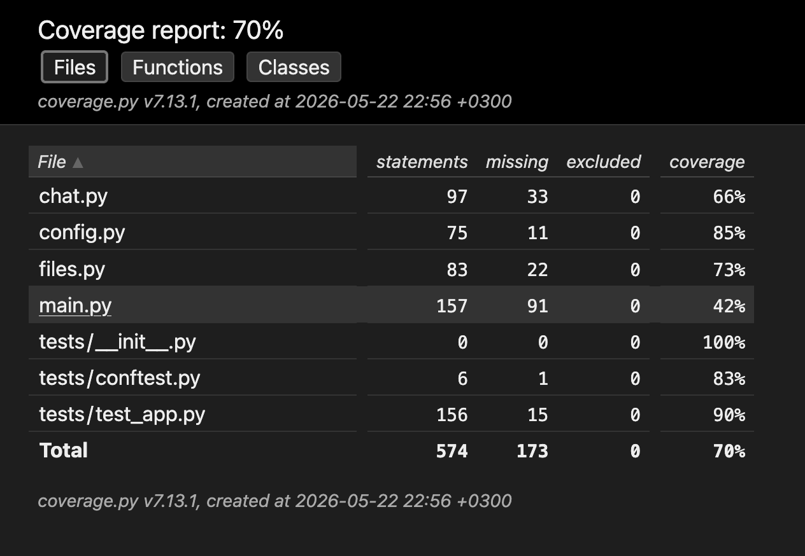

# GigaVibeMiptCode

Консольный ИИ-ассистент через OpenAI-совместимое API (Ollama, LM Studio,
OpenRouter, DeepSeek, GigaChat и т.п.).

## Возможности

- Чат с моделью, история сообщений хранится между ходами.
- Лимиты контекста по числу сообщений и сумме символов; слишком длинное
  одиночное сообщение обрезается слева. Системный промпт не выкидывается.
- Конфиг из переменных окружения (приоритет) и/или `config.yaml`.
- Подстановка содержимого файла через `@::/path/to/file::`
  (несколько за раз, лимит 5 МБ, только UTF-8).
- Пакетная обработка длинного файла командой `/file_chunk`:
  по абзацам, `paragraph=N`, `len=N`, флаг `-y` (без подтверждения).
- Команды `\q` (выход), `/reset` (очистка истории + экрана).
- Прерывание ответа модели по `Ctrl+C` (только во время ожидания LLM).
- Стриминг ответа по токенам.

## Структура

```
final_project/
├── main.py        - точка входа, главный цикл, команды, вывод в консоль
├── config.py      - загрузка конфигурации из env + yaml
├── chat.py        - Message, ChatHistory, LLMClient (общение с OpenAI)
├── files.py       - чтение файлов, @::...::, чанкование
├── tests/
│   └── test_app.py
├── ruff.toml
└── README.md
```

## Установка зависимостей

```bash
pip install openai pyyaml pytest pytest-cov mypy ruff types-PyYAML
```

## Запуск

```bash
cd final_project
vim config.yaml   # отредактировать ключи
python3 main.py
```

## Конфигурация

### Переменные окружения

| Переменная       | Описание                              |
| ---------------- | ------------------------------------- |
| `API_KEY`        | Токен подключения                     |
| `API_HOST`       | URL OpenAI-совместимого сервера       |
| `MODEL`          | Имя модели                            |
| `TEMPERATURE`    | Float от 0 до 1                       |
| `LIMIT_MESSAGES` | Максимум сообщений в истории          |
| `LIMIT_CHARS`    | Максимум символов в контексте         |

```bash
export API_KEY=sk-...
export API_HOST=https://api.deepseek.com/v1
export MODEL=deepseek-chat
python main.py
```

### config.yaml

```yaml
api_key: sk-...
api_host: https://api.deepseek.com/v1
model: deepseek-chat
temperature: 0.7
limit_messages: 20
limit_chars: 8000
system_prompt: |
  Ты ассистент для backend-задач на Python.
```

`system_prompt` доступен только из yaml. Файл с секретами в `.gitignore`.

## Проверки

```bash
ruff check --config ruff.toml .
mypy main.py chat.py config.py files.py tests
pytest tests/ --cov=. --cov-report=html --cov-report=term
```



